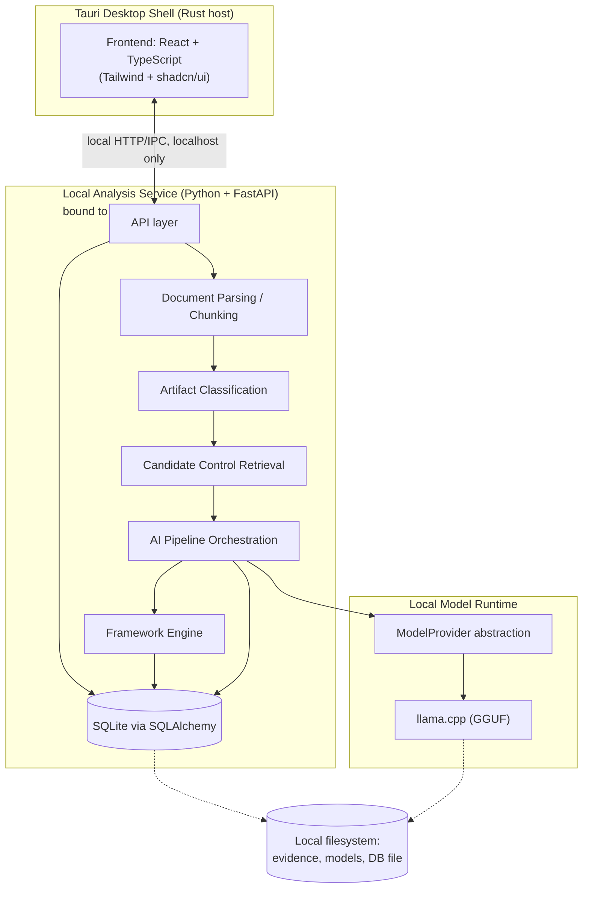
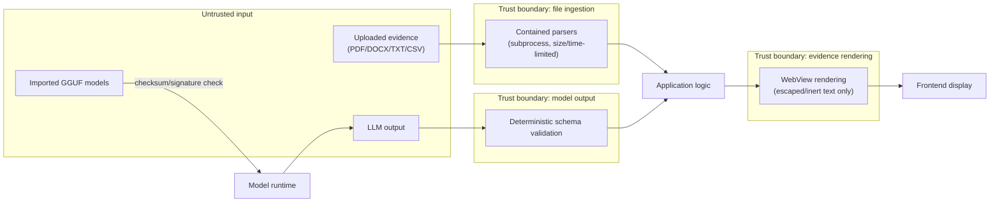

# EvidenceGraph — Architecture

Status: Sprint 0 draft. Critically evaluates the proposed stack rather than accepting it
uncritically; see `DECISIONS.md` for the ADRs behind each call made here.

## 1. Component Overview

## 2. Major Components

- **Desktop shell (Tauri, Rust host)**: process/window management, filesystem permission
  boundary, launches and supervises the local analysis service as a child process.
- **Frontend (React + TypeScript)**: all UI — assessment management, evidence upload, review,
  graph exploration, model/settings management. Talks to the local analysis service only.
- **Local analysis service (Python + FastAPI)**: owns the database, document parsing, framework
  engine, and AI pipeline orchestration. Bound to `127.0.0.1` (localhost) only — see
  `SECURITY.md`.
- **Model runtime (`ModelProvider` + llama.cpp)**: isolated behind an interface so the pipeline
  never depends on llama.cpp specifics directly. See `MODEL_RUNTIME.md`.
- **Framework engine**: loads framework definitions (Framework → Family → Control → Enhancement)
  from data files under `/frameworks`, not from application code.
- **SQLite database**: single local file, owned exclusively by the Python service (frontend never
  touches it directly).

## 3. Trust and Process Boundaries

Three boundaries matter most:

1. **File ingestion boundary**: every uploaded file is untrusted bytes until parsed by a
   size-limited, type-verified, contained parser. The containment mechanism is decided and
   implemented in Sprint 4, not deferred to later hardening (`DECISIONS.md` D-010) — Sprint 13 then
   verifies/hardens it adversarially. Process separation (a subprocess) alone is **not** the
   requirement — the boundary must restrict the parser worker to read-only access on its own input,
   write access to a dedicated scratch location only, no database/credential/network access, and
   enforced memory/CPU/time/archive-size limits (`DECISIONS.md` D-022); the specific mechanism
   providing these properties is still open (`OPEN_QUESTIONS.md` S-1). Extracted text is still
   treated as *data*, never as instructions, downstream (see `SECURITY.md`).
2. **Model output boundary**: LLM output is untrusted/probabilistic. It must pass deterministic
   schema validation before being persisted as a Mapping Candidate. A model that returns malformed
   JSON, an unknown control ID, or an out-of-range confidence is rejected, not "best-effort
   parsed."
3. **Evidence rendering boundary**: evidence text, section citations, and model-generated reasoning
   summaries are untrusted content reaching a real browser-engine rendering context (the Tauri
   WebView). They must be rendered as inert/escaped text, never raw HTML or interpreted Markdown,
   unless a future feature explicitly adds a sanitized rich-rendering path. See `SECURITY.md` T-21.

Process boundary: the frontend (Tauri/React) never directly parses evidence, never directly talks
to the model runtime, and never directly touches the database. Everything evidence-related goes
through the local analysis service, which is the only component with filesystem/database/model
access beyond what the OS file picker exposes to the frontend for selecting files to upload.
This boundary is also where authentication applies (§4): the local service must reject any caller
that doesn't present the current session's shared-secret token, regardless of which local process
is calling.

## 4. Desktop / Frontend / Backend Interaction

- Tauri launches the FastAPI service as a local child process on app start and terminates it on
  app exit.
- Frontend communicates with the service over HTTP restricted to `127.0.0.1` on a locally
  allocated port, bound atomically by the child using port 0 (D-018/D-025).
- Localhost binding restricts *network* reachability but is not authentication (`SECURITY.md`
  T-09): the Tauri host generates a random shared-secret token at each app launch, passes it to the
  verified FastAPI child through private inherited pipes/handles and to the frontend via Tauri IPC,
  and every local-service request must carry that token (`DECISIONS.md` D-009). This is a
  lightweight, session-scoped mechanism — not a user login/credential system.
- A token alone doesn't prove the *service* is legitimate, so startup additionally runs a
  fail-closed identity-verification handshake before any token or evidence is exposed to the
  frontend (`DECISIONS.md` D-018): Tauri launches its own bundled service executable and passes a
  one-time startup secret via private inherited pipes/handles supporting both directions; the child
  binds an OS-assigned loopback
  port (port 0) and reports it back over that same private channel; Tauri then issues a challenge
  over the resulting HTTP endpoint and verifies the response against the startup secret, without
  ever sending that secret over HTTP. After verification, Tauri sends the session token through
  the private channel and waits for the child's authentication-ready acknowledgement before
  exposing the endpoint/token to the frontend (D-025). Environment variables cannot provide this
  bidirectional exchange. Any failure (child exit, bind failure, timeout, bad challenge
  response) fails closed — no fallback to whatever else may be listening on a port.
- The model runtime (llama.cpp) has its **own** independent credential, separate from the D-009
  token, held only within the FastAPI process boundary and never exposed to the frontend
  (`DECISIONS.md` D-017, `MODEL_RUNTIME.md` §10) — the FastAPI↔frontend boundary and the
  FastAPI↔model-runtime boundary are each authenticated on their own terms, not one inheriting
  security from the other.
- No remote network calls originate from the local analysis service in V0.1 except: (a) model
  catalog fetch/download, which is an explicit, visible, user-initiated network action, never
  silent.

## 5. Database Ownership

SQLite file lives in the app's local data directory. Only the Python service opens it (via
SQLAlchemy). No other process, including the frontend, reads or writes it directly. This keeps a
single writer, avoids SQLite multi-process contention, and keeps the schema an internal
implementation detail the frontend never depends on directly.

## 6. Model Runtime

See `MODEL_RUNTIME.md` for detail. Architecturally: the AI pipeline depends only on capability
interfaces — `GenerationCapable` (`generate(prompt, schema) -> structured_output`) and
`EmbeddingCapable` (`embed(text) -> vector`) — not on llama.cpp specifics, and not on the
assumption that one model must serve both roles (`DECISIONS.md` D-011, completed by D-023: each
capability gets its own health check, hardware feasibility accounts for both models' combined
footprint if run simultaneously, and provenance records both models' identities separately). V0.1
ships exactly one provider implementation, `LlamaCppProvider`, which may back either or both
capabilities, run as a local subprocess/server bound to localhost and gated by its own
authentication credential independent of the FastAPI↔frontend token (`DECISIONS.md` D-017).

## 7. Document Pipeline

Artifact → secure file handling → text extraction → semantic sectioning/chunking → artifact
classification → candidate control retrieval → LLM candidate evaluation → structured mapping
output → deterministic validation → confidence calculation → analyst review. Detailed in
`AI_PIPELINE.md`.

## 8. Framework Engine

Framework content (families, controls, enhancements, official text) is **data**, loaded from
`/frameworks/<framework-id>/`, not hardcoded into application logic. The application logic that
walks Framework → Family → Control → Enhancement, resolves candidate controls, and renders
control detail must work for any framework conforming to the (yet-to-be-finalized-in-detail)
framework data format — it must not special-case NIST identifiers (e.g. must not assume all
control IDs match `^[A-Z]{2}-\d+$`, since future frameworks will not share that shape).

Family is **optional**, not required: a Control may belong to a Control Family or attach directly
to its Framework (`DECISIONS.md` D-016). Requiring every framework to have a family-level grouping
would itself be a NIST-shaped assumption baked into the schema, even though NIST 800-53 Rev. 5 does
use families. Full arbitrary-depth nested grouping is explicitly not attempted in V0.1 — see
`OPEN_QUESTIONS.md` A-5 — this is a proportional fix (optional single grouping level), not a
generalized hierarchy engine.

## 9. AI Pipeline (Summary)

See `AI_PIPELINE.md`. Architecturally significant point: retrieval happens *before* LLM
evaluation to bound the prompt to a small candidate set per artifact section, rather than a
single mega-prompt containing all controls and all evidence.

## 10. Graph Representation

For V0.1's scope (single assessment, hundreds not millions of nodes), the relationship graph is
represented relationally in SQLite (Mapping Candidate rows are the edges; Control/Artifact rows
are the nodes) and assembled into a graph structure at query time for the frontend to render.
**No dedicated graph database in V0.1** — see `DECISIONS.md` D-002. This may need revisiting if
graph exploration performance or query complexity outgrows relational queries, but that
justification does not exist yet.

## 11. Offline Behavior

After initial app install and model download, the application must function with no network
access: assessment CRUD, evidence upload/parsing, AI analysis, review, and graph exploration are
all local operations. The only features that inherently require network access are: model catalog
browsing and model download. The UI must make clear which actions require network access.

## 12. Future Extensibility

- Additional frameworks: add a new `/frameworks/<id>/` data set; no engine code changes required
  if the framework engine is built to the genericity rule in §8.
- Additional model providers: implement `ModelProvider`; no pipeline changes required.
- Multi-user/collaboration: would require moving off single-writer SQLite and adding an identity
  model — explicitly deferred, not designed against in V0.1's schema beyond not actively
  precluding it.

## 13. Stack Evaluation

The proposed stack (Tauri, React/TypeScript, Tailwind/shadcn, Python/FastAPI local service,
SQLite/SQLAlchemy, llama.cpp/GGUF) is accepted for V0.1 with the following notes:

- **Tauri over Electron**: appropriate — smaller footprint, Rust host reduces attack surface for
  the permission-sensitive parts (filesystem, process spawn) versus a full Node/Chromium host
  process. Reasonable fit for a security-focused desktop tool.
- **Python/FastAPI local service over doing everything in the Rust/Tauri host**: accepted because
  the document parsing, embeddings, and llama.cpp ecosystem tooling is materially more mature in
  Python. Tradeoff: introduces an IPC/process boundary (mitigated by binding strictly to
  localhost) and a second runtime to package/ship. This is the single biggest packaging risk for
  V0.1 (bundling a Python runtime inside a Tauri app) and should be validated early in Sprint 1
  rather than assumed to be smooth.
- **SQLite/SQLAlchemy**: appropriate for a local-first, single-writer desktop app. No objection.
- **llama.cpp/GGUF**: reasonable default for broad local hardware support (CPU-only through
  GPU-accelerated) without a heavier serving stack. Accepted as the sole V0.1 provider behind
  `ModelProvider`.
- **No graph database, no message queue, no Kubernetes, no microservices**: correct call for this
  scope; see `DECISIONS.md` D-002.

Port allocation and the startup exchange are defined by D-018/D-025. The concrete Windows
pipe/handle and process-supervision implementation is validated in S1-04/S1-09.
