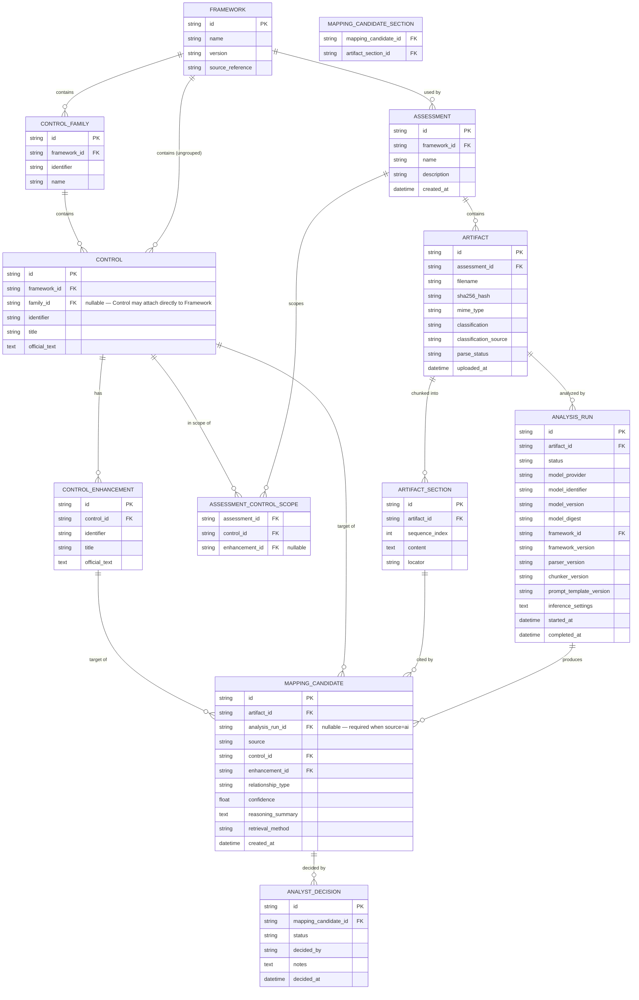

# EvidenceGraph — Proposed Data Model

Status: Sprint 0 draft. Proposes an initial schema shape for discussion; **no migrations are
created in Sprint 0**. Implementation (Sprint 2) should treat this as a strong starting point,
subject to the usual migration discipline once real migrations exist (`AGENT_INSTRUCTIONS.md`
rule 8).

## 1. Entity-Relationship Diagram

Note: `MAPPING_CANDIDATE_SECTION` is the join table for the many-to-many between a Mapping
Candidate and the Artifact Sections it cites (a candidate may cite more than one section).

## 2. Entity Notes

### framework / control_family / control / control_enhancement
Loaded from `/frameworks/<id>/` data files (see `ARCHITECTURE.md` §8), not user-editable through
the app in V0.1. `identifier` is the framework-native identifier (e.g. `AC-2`); `id` is an
internal surrogate key so the schema never assumes identifier format. `official_text` is verbatim
framework language — never modified by the app or by AI. `control.family_id` is **nullable**: a
Control may belong to a Control Family or attach directly to its Framework via the denormalized
`control.framework_id` (`DECISIONS.md` D-016) — this keeps the schema from forcing a future
framework without family-level grouping into NIST's two-level shape. When `family_id` is set, its
`control_family.framework_id` must match `control.framework_id` (application-layer check; a
composite FK is the stricter option if SQLite's support for it is acceptable).

### assessment / assessment_control_scope
`assessment` is the top-level container. `framework_id` fixed to NIST 800-53 Rev. 5 in V0.1 (single
row in `framework` table), but the FK exists so the schema doesn't need to change when a second
framework is added. `assessment_control_scope` is normally **empty** in V0.1 (implicit "all
controls in the assessment's framework are in scope"); explicit rows only exist if/when
`OPEN_QUESTIONS.md` P-1 is resolved to allow baseline/subset selection at assessment creation. Gap
computation (`COMPLIANCE_MODEL.md` §2 "Finding / Gap") must check this table when rows exist for an
assessment and fall back to "every control in the framework" when they don't, rather than assuming
one mode unconditionally.

### artifact
`sha256_hash` is unique-checked within an assessment to support duplicate detection
(`USER_FLOWS.md` §5). `classification` is nullable until classification runs; `classification_source`
(`ai` vs. `analyst`) records whether the current value is AI-assigned or analyst-corrected.
`parse_status`: `pending` / `parsing` / `parsed` / `partial` / `empty` / `unsupported_format` /
`failed` — see "Extraction Outcomes" below (this expands the original four-value set, which had no
way to represent a file that parsed but yielded no usable text, a partially-successful extraction
with some sections recovered, or a file whose format isn't actually supported despite passing the
initial upload filter).

### analysis_run
One row per analysis attempt against an artifact (`COMPLIANCE_MODEL.md` "AnalysisRun",
`DECISIONS.md` D-012/D-013). `status`: `succeeded` / `succeeded_no_mappings` / `failed` /
`superseded`. Carries the immutable configuration-identity fields (model/framework/parser/chunker/
prompt versions) so they aren't duplicated per `mapping_candidate` row. A later run against the same
artifact does not delete or mutate an earlier run's rows — mark the earlier run `superseded` instead
(the mapping candidates it produced remain queryable for audit purposes; whether they're hidden by
default in the review UI is a `USER_FLOWS.md` concern, not a schema one).

### artifact_section
`locator` is a human-meaningful pointer back into the source document (e.g. page number, heading
path, CSV row range) so the review UI can show "where in the document" beyond just the id.

### mapping_candidate
Immutable once created (`COMPLIANCE_MODEL.md` §4). `source`: `ai` or `analyst_manual`
(`DECISIONS.md` D-015). When `source = ai`, `analysis_run_id` is required and provenance fields
(`model_*`, framework/parser/prompt versions) live on the referenced `analysis_run`, not duplicated
here. When `source = analyst_manual`, `analysis_run_id`, `confidence`, and `retrieval_method` are
null — there is no run or model behind a manually-created mapping. Re-running analysis on an
artifact creates a new `analysis_run` and new `mapping_candidate` rows rather than mutating old
ones — old candidates remain for audit trail even if their run is later marked `superseded`.

### analyst_decision
Deterministically append-only: rows are only ever inserted, never updated or deleted. Current
status for a mapping candidate = the decision row with the latest `decided_at` for that
`mapping_candidate_id`. `decided_by` is the local user identity — in V0.1 single-user, likely a
fixed local placeholder value rather than a real user table; revisit if multi-user is ever built.

## 3. Extraction Outcomes

`artifact.parse_status` values and their meaning (addresses the gap where the original four-value
set couldn't distinguish these outcomes):

- `pending` — uploaded, not yet parsed.
- `parsing` — in progress.
- `parsed` — text extraction fully succeeded.
- `partial` — extraction succeeded for some but not all of the document (e.g. some pages/sections
  failed within otherwise-usable limits); the artifact is still analyzable on its recovered
  sections, and the partial-extraction condition must be visible to the user, not silently hidden.
- `empty` — parsing succeeded mechanically but produced no extractable text (e.g. a scanned-image
  PDF with no OCR in V0.1's scope, or a genuinely empty file) — a valid, non-error outcome distinct
  from `failed`, but one that means no analysis can run on this artifact until content exists.
- `unsupported_format` — the file passed initial upload filtering (extension/MIME sniff) but the
  parser determined it cannot actually process the content (e.g. a corrupted container, or a format
  variant outside what the chosen library supports) — distinct from `failed`, which implies the
  parser attempted and errored, versus this, which means parsing was never meaningfully attempted.
- `failed` — parsing was attempted and errored (crash, timeout, resource-limit exceeded, corruption
  the parser couldn't recover from).

## 4. Deliberately Not Modeled in V0.1 (see `COMPLIANCE_MODEL.md`)

- `policy` / `policy_statement` as first-class tables — deferred; "policy" is an `artifact`
  classification value in V0.1. No policy versioning/lifecycle/authoring subsystem.
- A separate `finding` / `gap` table — computed at query time from `control` + `mapping_candidate`
  + `analyst_decision` (+ `assessment_control_scope` where present), not persisted. See
  `COMPLIANCE_MODEL.md` §2 "derived view vs. future Finding" for why this is deliberately not a
  persisted entity in V0.1.
- Any table representing "this control is compliant" — no such concept exists in this model.
- Arbitrary-depth nested control grouping — `control_family` is one optional level, not a
  general recursive hierarchy (`DECISIONS.md` D-016, `OPEN_QUESTIONS.md` A-5).

## 5. Constraints and Indexes (starting points)

- `artifact.assessment_id` + `artifact.sha256_hash`: unique index (duplicate detection scope is
  per-assessment, not global — cross-assessment duplicate detection is out of scope for V0.1 and
  would risk the cross-assessment contamination concern in `SECURITY.md` T-16).
- `mapping_candidate.artifact_id`, `mapping_candidate.control_id`: indexed — both "mappings for
  this artifact" and "mappings for this control" are core query paths (artifact review and control
  review screens respectively).
- `mapping_candidate.analysis_run_id`: indexed; nullable, required when `source = 'ai'` (enforce via
  a `CHECK` constraint: `source = 'ai' AND analysis_run_id IS NOT NULL` OR
  `source = 'analyst_manual' AND analysis_run_id IS NULL`).
- `analysis_run.artifact_id`: indexed — "all analysis attempts for this artifact," including
  superseded ones, is a core provenance/audit query.
- `analyst_decision.mapping_candidate_id` + `decided_at`: indexed for "latest decision" lookups.
- Foreign keys enforced (SQLite `PRAGMA foreign_keys = ON`), including `artifact.assessment_id` →
  `assessment.id`, to make cross-assessment contamination a constraint violation, not just a bug.
- **Cross-framework invariant** (`COMPLIANCE_MODEL.md` §8): `mapping_candidate.control_id`'s
  framework must match `mapping_candidate.artifact_id`'s `assessment.framework_id`. SQLite foreign
  keys alone don't express this (it spans two FK chains), so it must be enforced either via a
  `CHECK`/trigger comparing denormalized `framework_id` columns, or as an application-layer
  invariant enforced at write time in every code path that creates a `mapping_candidate` — this
  must not be left as an assumption that "of course they'll always match," since a second framework
  is explicitly planned future work that would otherwise make this a live risk.
- `control.family_id`, when non-null, must reference a `control_family` whose `framework_id` matches
  `control.framework_id` — same cross-chain caveat as above.

## 6. Migrations

None created in Sprint 0, per instructions. Once implementation begins, schema changes must go
through versioned migrations (e.g. Alembic, given SQLAlchemy) — no ad hoc schema edits against a
running local database, since assessment data must survive app upgrades.

See also: `COMPLIANCE_MODEL.md` for the conceptual model this schema implements, `ARCHITECTURE.md`
§5 for database ownership rules.
