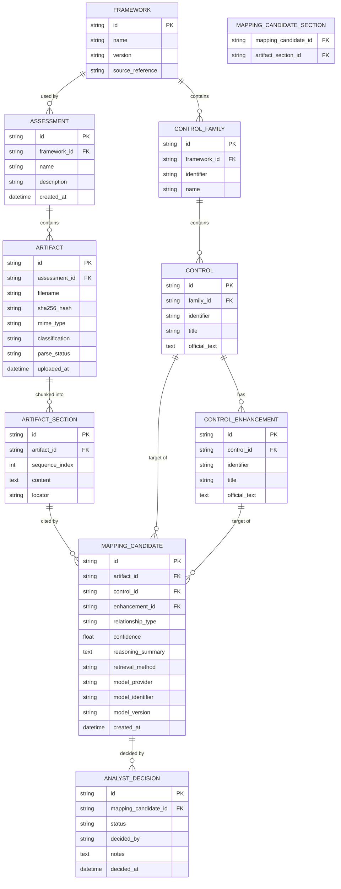

# EvidenceGraph — Proposed Data Model

Status: Sprint 0 draft. Proposes an initial schema shape for discussion; **no migrations are
created in Sprint 0**. Implementation (Sprint 2) should treat this as a strong starting point,
subject to the usual migration discipline once real migrations exist (`AGENT_INSTRUCTIONS.md`
rule 5).

## 1. Entity-Relationship Diagram

Note: `MAPPING_CANDIDATE_SECTION` is the join table for the many-to-many between a Mapping
Candidate and the Artifact Sections it cites (a candidate may cite more than one section).

## 2. Entity Notes

### framework / control_family / control / control_enhancement
Loaded from `/frameworks/<id>/` data files (see `ARCHITECTURE.md` §8), not user-editable through
the app in V0.1. `identifier` is the framework-native identifier (e.g. `AC-2`); `id` is an
internal surrogate key so the schema never assumes identifier format. `official_text` is verbatim
framework language — never modified by the app or by AI.

### assessment
Top-level container. `framework_id` fixed to NIST 800-53 Rev. 5 in V0.1 (single row in
`framework` table), but the FK exists so the schema doesn't need to change when a second
framework is added.

### artifact
`sha256_hash` is unique-checked within an assessment to support duplicate detection
(`USER_FLOWS.md` §5). `classification` is nullable until classification runs; can be
AI-set then analyst-corrected (consider a separate `classification_source` field —
`ai` vs. `analyst` — open implementation detail, not modeled above but recommended).
`parse_status`: `pending` / `parsing` / `parsed` / `failed`.

### artifact_section
`locator` is a human-meaningful pointer back into the source document (e.g. page number, heading
path, CSV row range) so the review UI can show "where in the document" beyond just the id.

### mapping_candidate
This is the AI-generated suggestion, immutable once created (`COMPLIANCE_MODEL.md` §4). Re-running
analysis on an artifact creates new rows rather than mutating old ones — old candidates remain for
audit trail even if superseded; whether superseded candidates are hidden by default in the UI is a
`USER_FLOWS.md` open question, not a schema concern.

### analyst_decision
Append-only. Current status for a mapping candidate = the decision row with the latest
`decided_at` for that `mapping_candidate_id`. `decided_by` is the local user identity — in V0.1
single-user, likely a fixed local placeholder value rather than a real user table; revisit if
multi-user is ever built.

## 3. Deliberately Not Modeled in V0.1 (see `COMPLIANCE_MODEL.md`)

- `policy` / `policy_statement` as first-class tables — deferred; "policy" is an `artifact`
  classification value in V0.1.
- A separate `finding` / `gap` table — computed at query time from `control` + `mapping_candidate`
  + `analyst_decision`, not persisted.
- Any table representing "this control is compliant" — no such concept exists in this model.

## 4. Constraints and Indexes (starting points)

- `artifact.assessment_id` + `artifact.sha256_hash`: unique index (duplicate detection scope is
  per-assessment, not global — cross-assessment duplicate detection is out of scope for V0.1 and
  would risk the cross-assessment contamination concern in `SECURITY.md` T-16).
- `mapping_candidate.artifact_id`, `mapping_candidate.control_id`: indexed — both "mappings for
  this artifact" and "mappings for this control" are core query paths (artifact review and control
  review screens respectively).
- `analyst_decision.mapping_candidate_id` + `decided_at`: indexed for "latest decision" lookups.
- Foreign keys enforced (SQLite `PRAGMA foreign_keys = ON`), including `artifact.assessment_id` →
  `assessment.id`, to make cross-assessment contamination a constraint violation, not just a bug.

## 5. Migrations

None created in Sprint 0, per instructions. Once implementation begins, schema changes must go
through versioned migrations (e.g. Alembic, given SQLAlchemy) — no ad hoc schema edits against a
running local database, since assessment data must survive app upgrades.

See also: `COMPLIANCE_MODEL.md` for the conceptual model this schema implements, `ARCHITECTURE.md`
§5 for database ownership rules.
